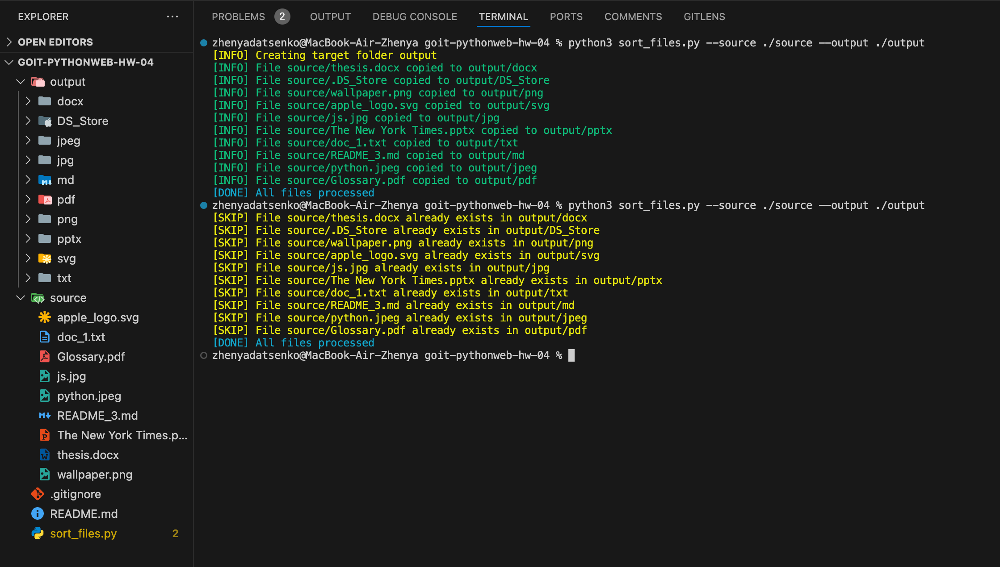

# Asynchronous Programming in Python

## Overview

This Python script sorts files from a specified source folder into subfolders in a destination folder based on their file extensions. The script performs the sorting asynchronously, making it efficient for processing a large number of files.

## Features

- Asynchronous reading and copying of files.
- Files are organized into subfolders based on their extensions.
- Command line argument handling for source and destination folders.
- Error logging for any issues encountered during processing.
- Complies with PEP 8 standards for readability.

## Requirements

- Python 3.7 or higher
- `aiofiles` library for asynchronous file operations
- `colorama` library for colored console output (optional)

## Installation

1. Clone the repository or download the script.
2. Install the required libraries using pip:

   ```bash
   pip install aiofiles colorama
   ```

## Usage

Run the script from the command line with the following syntax:

```bash
python script_name.py --source <source_folder> --output <output_folder>
```

### Arguments

- `--source`: Path to the source folder containing files to be sorted.
- `--output`: Path to the destination folder where sorted files will be placed.

### Example

```bash
python file_sorter.py --source /path/to/source --output /path/to/destination
```

## Error Handling

All errors encountered during the execution of the script are logged. Ensure to check the logs for any issues related to file copying or folder access.

## Results


